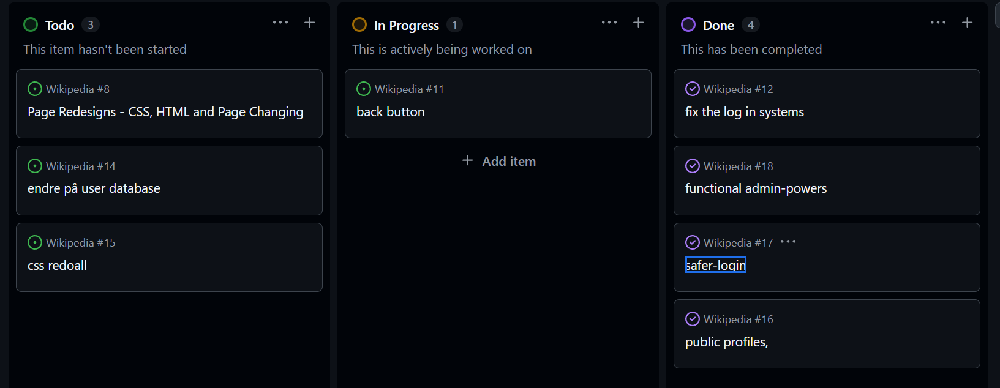

# Prosjektbeskrivelse og  dokumentasjon

##  Prosjekttittel
**Wikipedia**

---

## 1. Prosjektidé og problemstilling

### Beskrivelse
Jeg skal lage en app som lar personen lage sider hvor de kan skrive artikler selv, logge inn med enten en admin konto eller normal user. 
- Hva er prosjektet ditt?

## Hva skal jeg gjøre på Eksamensdagen

- *Beskriv det du har planlagt å gjøre* 

- først lage muligheten til å slette brukere for admins, eller gjøre dem inaktive vis de brøt regler

- jeg hadde tenkt til å lage sider hvor man kunne se informasjonen om en bruker, som når de lagde brukeren og sist brukte brukeren. 

- lage en tilbake knapp som tok deg til neste side

- lage en tryggere log in, gi brukeren maks 3 muligheter til å prøve å logge in


- Lag et godt og detaljert Kanban-board (github-projects) som du viser for sensor. Legg inn link her
https://github.com/users/TheCatSchool/projects/4
---
## 2. Systembeskrivelse

**Formål med applikasjonen:**\
*Forklar hva du ønsket å oppnå med prosjektet.*

- jeg ønsket å oppnå å lage en informasion encyclopedia som gir muligheten til at nesten alle kan lage og edite sine sider med få regler fordi mange moderne sider er veldig overregulerte

**Brukerflyt:**\
*Beskriv hvordan brukeren bruker løsningen -- fra startside til lagring av data.*
først så logger brukeren inn med, dermed kan de enten gå til "pages" eller ta linken fra rett profilen deres til å lage en side

de kan da skrive en titel og innholdet. etter det blir de sent til artikkelen for å lese den, her kan de velge å edite eller gå tilbake til pages for å lese mer

**Teknologier brukt:**

-   Python / Flask\
-   MariaDB\
-   HTML / CSS / JS\
-  Waitress
- Debian


------------------------------------------------------------------------

## 3. Server-, infrastruktur- og nettverksoppsett

### Servermiljø


*Debian, Fysisk server*

### Nettverksoppsett

-   Nettverksdiagram
-   IP-adresser\
10.200.14.14
127.0.0.1
10.2.1.124
-   Porter\ 
8080
-   Brannmurregler
allow 8080
allow ssh(for pi vis det trenges)

Nettverksdiagram:
Flask:

    Klient → nettside → Flask → Debian → MariaDB
Waitress:

   Klient → nettside → Waitress → firewall 8080 → Debian → MariaDB

### Tjenestekonfigurasjon

-   systemctl / Supervisor\
-   Filrettigheter\
-   Miljøvariabler

------------------------------------------------------------------------

## 4. Prosjektstyring -- GitHub Projects (Kanban)




Refleksjon: Hvordan hjalp Kanban arbeidet?
Kanban hjalp mye med å la meg planlegge litt hvordan jeg skulle gjøre ting og i hvilken rekefølge jeg burde gjøre det

jeg brukte det også som en litt check list siden jeg kunne ikke lage safe log ins uten å fikse problemer med den først

------------------------------------------------------------------------

## 5. Databasebeskrivelse

**Databaser:**
users - brukere til nettsiden
pages - artikkler i nettsiden
**Tabeller:**
```
+-----------------+--------------+------+-----+---------+----------------+
| Field           | Type         | Null | Key | Default | Extra          |
+-----------------+--------------+------+-----+---------+----------------+
| ID              | int(11)      | NO   | PRI | NULL    | auto_increment |
| Username        | varchar(75)  | NO   | UNI | NULL    |                |
| Password_hashed | varchar(225) | NO   |     | NULL    |                |
| Email           | varchar(100) | YES  |     | NULL    |                |
| Active          | tinyint(1)   | YES  |     | 1       |                |
| Role            | varchar(10)  | NO   |     | user    |                |
+-----------------+--------------+------+-----+---------+----------------+
```
```
+-----------+--------------+------+-----+---------------------+-------------------------------+
| Field     | Type         | Null | Key | Default             | Extra                         |
+-----------+--------------+------+-----+---------------------+-------------------------------+
| ID        | int(11)      | NO   | PRI | NULL                | auto_increment                |
| Title     | varchar(255) | NO   | UNI | NULL                |                               |
| Slug      | varchar(255) | NO   | UNI | NULL                |                               |
| Content   | text         | NO   |     | NULL                |                               |
| CreatorID | int(11)      | YES  | MUL | NULL                |                               |
| CreatedAt | timestamp    | YES  |     | current_timestamp() |                               |
| UpdatedAt | timestamp    | YES  |     | current_timestamp() | on update current_timestamp() |
+-----------+--------------+------+-----+---------------------+-------------------------------+
```
**SQL-eksempel:**

``` sql
CREATE TABLE users (
    ID              INT(11)         NOT NULL AUTO_INCREMENT,
    Username        VARCHAR(75)     NOT NULL,
    Password_hashed VARCHAR(225)    NOT NULL,
    Email           VARCHAR(100)    DEFAULT NULL,
    Active          TINYINT(1)      DEFAULT 1,
    Role            VARCHAR(10)     NOT NULL DEFAULT 'user',
    PRIMARY KEY (ID),
    UNIQUE KEY (Username)
);
```
``` sql
CREATE TABLE pages (
    ID          INT(11)      NOT NULL AUTO_INCREMENT,
    Title       VARCHAR(255) NOT NULL,
    Slug        VARCHAR(255) NOT NULL,
    Content     TEXT         NOT NULL,
    CreatorID   INT(11)      DEFAULT NULL,
    CreatedAt   TIMESTAMP    DEFAULT CURRENT_TIMESTAMP,
    UpdatedAt   TIMESTAMP    DEFAULT CURRENT_TIMESTAMP ON UPDATE CURRENT_TIMESTAMP,
    PRIMARY KEY (ID),
    UNIQUE KEY (Title),
    UNIQUE KEY (Slug),
    KEY (CreatorID),
    FOREIGN KEY (CreatorID) REFERENCES users(ID) ON DELETE SET NULL
);
```


------------------------------------------------------------------------

## 6. Programstruktur

    Wikipedia/
    ├── documentation
    ├────── howtouse.md
    ├────── sources.md
    ├── app.py
    ├── templates/
    ├──────home.hmtl
    ├──────pages.html
    ├──────osv.html
    ├── static/
    ├────── style.css
    └── venv
    └──.gitignore
    └──req.txt

Databasestrøm:

    HTML → Flask → MariaDB → Flask → HTML-tabell

------------------------------------------------------------------------

## 7. Kodeforklaring

`````
@app.route("/login", methods=["GET", "POST"])
@limiter.limit("3 per minute", methods=["POST"]) 
def login():
    if session.get("role") == "user": ##checking if you are allready logged in or not
        return redirect('/profile')
    elif session.get("role") == "admin":
        return redirect('/admin')
    if request.method == "POST":
        brukernavn = request.form['brukernavn']
        passord = request.form['passord']
        #fetches username and password for log in
        
        conn = get_db_connection()
        cursor = conn.cursor(dictionary=True)
        cursor.execute("SELECT * FROM users WHERE Username=%s", (brukernavn,)) #fetches user with matching username
        user = cursor.fetchone()

        # cursor.execute("SELECT Active FROM users WHERE Username=%s", (brukernavn,))
        # activity = cursor.fetchone()
       
        
       
        if user and check_password_hash(user['Password_hashed'], passord):
            session.clear() #if the username's password hashed = the inserted password hashed. then continue
            session['user'] = user['Username'] #set sessions
            session['role'] = user['Role']
            session['id'] = user['ID']
            x = user['ID']
            cursor.execute("UPDATE users SET UsedAt = current_timestamp() where id =%s", (x,))
            conn.commit()

            if user['Active'] == 0:
                
                cursor.close()
                conn.close()
                return redirect('/banned')  
            else:
                
                cursor.close()
                conn.close()
                if user['Role'] == 'admin': #if user = admin redirect to admin else redirect to profile
                    return redirect('/admin')
                else:
                    return redirect('/profile')
        else:
            cursor.close()
            conn.close()
            return render_template("log.html", feil_melding="Ugyldig brukernavn eller passord") #if non matching, re render
        #ps: add max chances for safety.

    return render_template("log.html")
`````
Koden først definerer metodene til appen og setter en limits på hvor mange ganger du kan prøve å logge in før det ikke går mer

dermed sjekker den om det er en session og redirecter til riktig side vis det er siden det betyr at de har logget in fra før

dermed henter den informasjonen som er skrevet inn i info boxene. så henter den connection til mariadb.

så henter den alle brukere med brukernavnet til brukernavnet som ble satt in, siden bruker navn er unique så kan de få mer.

så sjekker de useren sin activity og om den er 0 eller 1. 

dermed hasher den passorder som blir gitt in og vis den er lik passorder til usernamet sitt passord hashed
hvis den er riktig så clearer de session(for å garantere at det ikke er en) og setter en nye session med informasjonen til brukeren som session id og username. 

men vis active er 0 så blir man redircted til en side hvor det står at brukeren er banned og ikke kan brukes, her blir session cleared så at man ikke kan bruke brukeren. 

så sjekker programmet om du er admin eller normal user og sender de til deres respektive sider. 

vis hashed passord ikke var lik user passord blir man redircted til log in med en feil melding. 


------------------------------------------------------------------------

## 8. Sikkerhet og pålitelighet
|trussel| konsekvens | tiltak |
|-------|------------|-------------|
|Brute force|bruker kan bli hacked og kan skape system lag|flaks limiter med 3 log ins per minutt|
|Admin-abuse|admin brukere med acesss til datbase kan se passordet til brukere| wekrezug security og hashed passord lar man ikke se passordet i datbasen|
|sql injections| man kan tvinge in sql injections via promts som kan ødelge datbasen| safe injections|
|dårlig internett| kan stoppe development vis man trenger en internett connection for å bruke programmet| debian server på local hosten min|


------------------------------------------------------------------------

## 9. Feilsøking og testing

|Feil| konsekvens | Fiks |
|-------|------------|-------------|
|log in sessions ikke clearet helt| man kunne ikke bytte brukere uten å ha problemer med links til profile| session clear istendenfor session pop|
|normale brukere kunne bruke delete user kraften| bruker kunne slette andre brukere uten admin med å bare skrive /remove/<id> til bruken de ville slette| kreve admin session for at det skulle vrike
-   Testmetoder
user testing som lott meg se mange så feil med programmet mitt
å prøve koden i database først(ikke farlig kode)
bruke "live" function for å lage html og css live
------------------------------------------------------------------------

## 10. Konklusjon og refleksjon

-   Hva lærte du?\
-   Hva fungerte bra?\
-   Hva ville du gjort annerledes?\
-   Hva var utfordrende?

------------------------------------------------------------------------

## 11. Kildeliste

-   w3schools\
-   flask.palletsprojects.com
